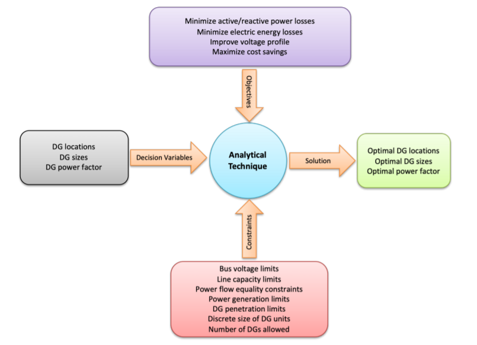
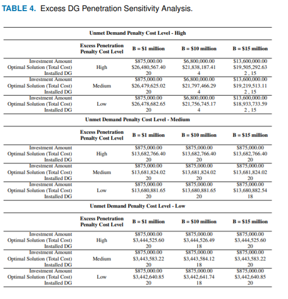
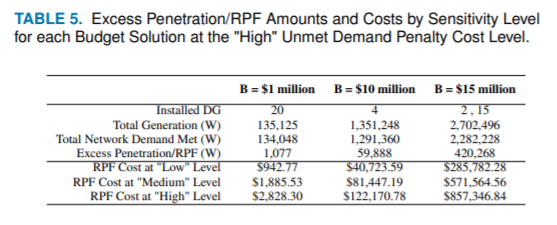

# DESCRIPTION OF THE DG PROBLEM

> ## What is a DG?
> * ***DG(Distributed Generator)***: 
>   - Have Microgrids that can be distributed in an area to maintain power 
>      for important facilities in the case of some event
>   - Localized low voltage grids that can operate autonomously from the main grid.
>   - Often uses multiple generation sources including renewable power resources that work together to to accomplish this task
>   - Main elements include:
>       - load/demand nodes
>       - energy storage units
>       - generation sources (renewable and nonrenewable)
>           - Control Tools:
>               + interconnection switch
>               + energy controller and management systems
>

> ## What is the task that needs to be accomplished?
>   - Have some set of mission-critical facilities (***demand nodes***) that are prioritized to maintain electrical power in some event
>       + Hospitals
>       + Grocery Stores
>   - Must answer the question:
>       + What is the optimal DG to facility assignment structure that:
>           - minimizes the number od DG's needed
>           - maximizes the number of important facilities that remain in operation
>           - Each facility must only be powered by 1 DG

# Traditional Formulation of the DG assignment problem:

> ## Previous Findings have focused on:
> 1. Potential of microgrids as Solution to large scale energy grid disturbance.
>    * Many places around the globe have used Microgrids as a solution to maintaining power duriing disasters
>       + 2011, a microgrid helped restore Japan from the East Japan earthquake.
>           + contained three different DG types and was kept in operation years 
>             after restoration from the earthquake was complete
>       + Montgomery County installed a 2 megawatt (MW) solar-based microgrid at the Public Safety Headquarters (PSHQ).
>           + PSHQ serves as the county’s hub for critical public services:
>             + transportation management resources
>             + Office of Emergency Management and Homeland Security
>             + the police station that serves the central portion of the county. 
>          + The microgrid was installed as part of a comprehensive effort to ensure resiliency of critical 
>            public services during large-scale grid disturbances.
>          + the microgrid saves the county $4 million in expenses for aging low-voltage and medium-voltage 
>           electrical system upgrades
>       + 2019, Fremont, California completed the first microgrid system installed at three fire stations
>           *  project demonstrates the islanding of critical infrastructure and increasing the protection 
>              of such infrastructure against power outages
>       * This research furthers this idea to include more essential resources in total and more essential 
>         resource types:
>         + hospitals,  
>         + gas stations,
>         + police stations
>         + grocery stores as opposed to just fire stations.
> 2. Negative impacts of high penetration levels of renewable generation can have on an existing electrical network, 
>    especially as it pertains to reverse power flow (RPF)
>       * Work has shown that one of the main issues that RPF can cause comes from the unidirectional nature of volatge
>         regulators and the fact the the RPF can cause this aspect to fail
>       * Work by the DOE acknowledges that penetration of renewables like PV could not only offset the load, but 
>         cause RPF in the distribution system which can then cause
>           - over-voltage
>           - increased short circuits
>           - breach of protection coordination
>           - incorrect operation of control equipment
>       * Our research presents a manner to mitigate RPF without having to account for large amounts of
>         bidirectional power flow
> 3. general optimization of DGs within a microgrid.

> ## Our role/contribution
> * THE ISE team proposes an 
>   - single-source capacitated facility location
coverage problem (SS-CFLCP) to optimize the location, assignment and number of renewable distributed
generators (DGs) within a utility-based microgrid during a large-scale grid disturbance, where the microgrid
is operating independent of the main grid. 
> * Traditional analytical techniques for DG placement within microgrids tend to focus on 
>   + minimizing power losses
>   + minimizing electric energy losses 
>   + improving voltage profile
>   + maximizing cost savings.
> * SS-CFLCP:
>   + combines facility location and location coverage problems
>   + minimze:
>       - total investment cost
>       - total operation and maintenance cost
>       - distance from source to sink
>       - unmet electricity demand
>       - excess renwable penetration due to risk of reverse power flow that can damage the main grid
>       - can use different levels of budget constraints for the investment cost of installing the DGs
>   + Can add resilience to electrical system in case of catastrophic loss of service in an optimal manner

# A Genetic Algorithm Based Solution:
> This part of the work seeks to use the tool of Genetic algorithms to perform this optimzation task. 
> Genetic Algorithms (GA) are a tool that uses the concept of treating a set of possible solutions to 
> some optimization tasks as a population of individual agents that will be scored on their ability to solve
> the problem and those that are the "fittest" will be used to geneate the next generation of solutions by 
> "breeding" the most fit in an effort to mimic survivval of the fittest. To add varation to the populations there
> is a settable mutation rate that will add varation to the solutions in each generatoin. The way GA's represent 
> solutions are binary strings that must be interpreted in some manner as a solution that can be scored. For this takss 
> the binary strings will reprsent some set of DG to demand node assignemnts. 

# Problem Parameters:
B = Budget available for installation of DG's
F = set of demand nodes (mission critical facilities)
D = set of DG nodes
Note: 
    * Each F has:
        * power demand needs
        * physical location
        * Penalty for not meeting demand needs
    * Each J has:
        * investment cost
        * operation and maintenance cost
        * current level of output
        * maximum level of output
        * penalty for having left over power to keep RPF down
        * physical location
DIS_{IJ}: through the locations each distance from some dg D to some facility F

## Assumptions:
* DG are operating in island mode meaning the main grid is down
* DG operate during he day and backup generators provide low level power at night
* DG are capable of outputing full rated output
* one D to one F
* Set Budget can not be exceeded i.e.
  + Total Cost of DG installation * TotalPower
    + B <= Sum (Total Investment Cost_J * Total Power_J for all J's in operation) 

## GA Structure:

> chromosome: 
> - binary string of length N where N == number of possible DG's
> - 0 indicates DG i is not in operation
> - 1 indicates DG i is in operation 
> 
> Assignment Algorithm:
> * Use chromosome to select only those dg's that correspond to ones 
> + for all facility nodes:
>   * Find Rank all available DG's by distance
>   * Find the closest DG with some power left and assign current nodes
>       * if any attempted assignments will exceed budget options
>         * reject: continue to loop over the rest 
>           - Regs: allow for cost calculation when no assignments
>         * allow:
>           - Reqs: make sure to penalize how much over budget the solution is
> 

# Previously Found Best Solutions

